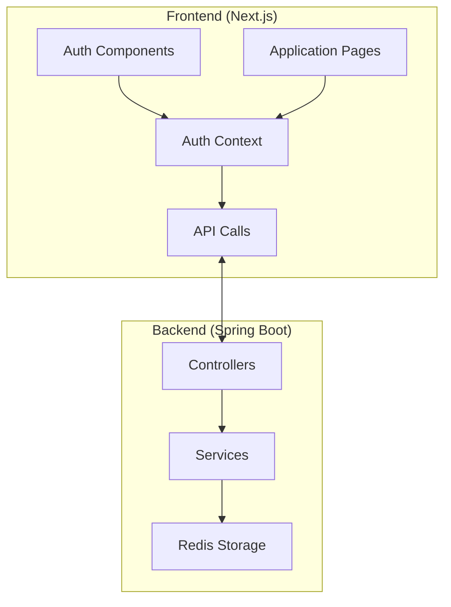
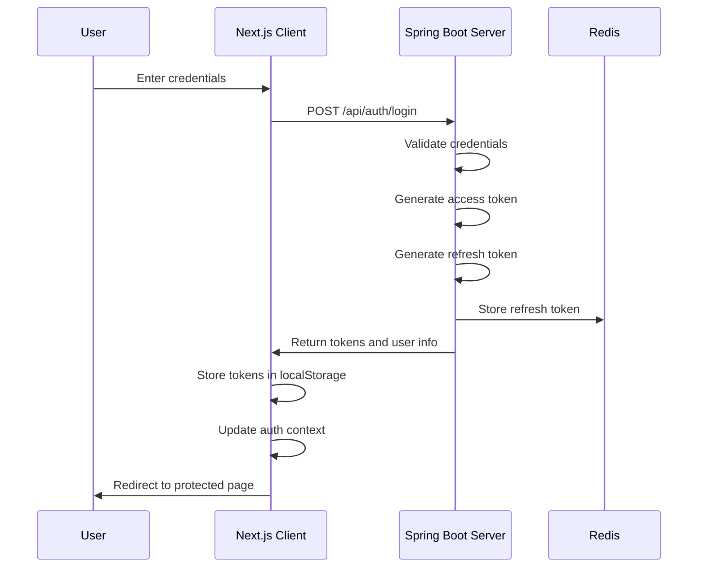
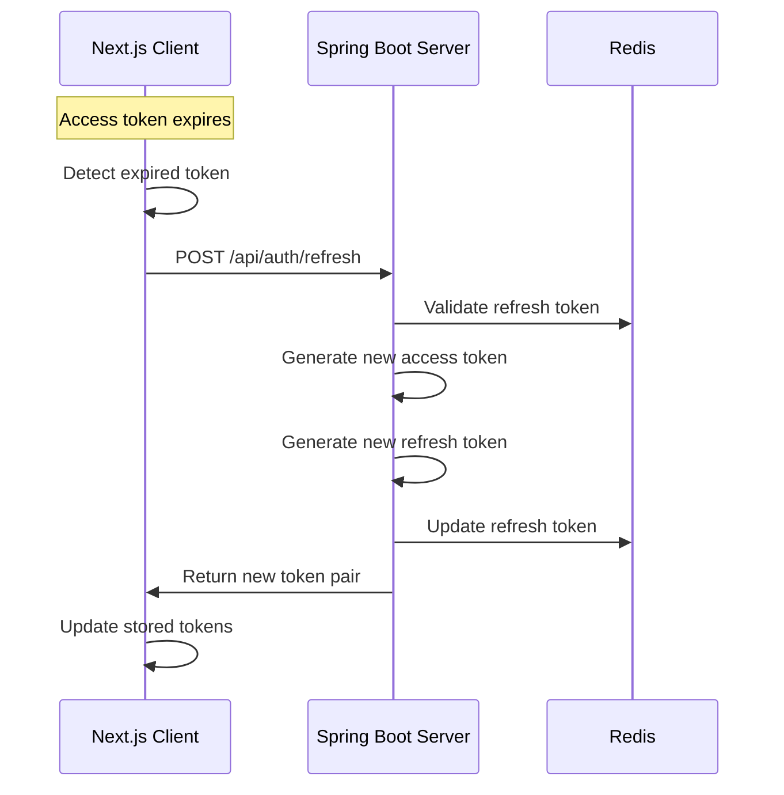
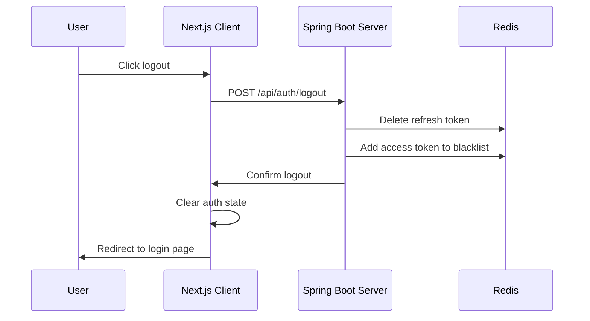

# JWT Authentication System

```bash
git clone https://github.com/DokaDev/jwt-web-snippets.git --recurse-submodules
```

This project demonstrates a complete JWT (JSON Web Token) authentication system with a Next.js frontend client and a Spring Boot backend server. The system implements secure authentication flows with access tokens and refresh tokens stored in Redis.

## Project Structure

The project consists of two main components:

1. **auth-service-client**: Next.js frontend client application
2. **auth-service-test**: Spring Boot backend server application

### System Architecture



## Authentication Flow

### Login Flow



### Token Refresh Flow



### Logout Flow



## Detailed Component Descriptions

### Frontend (auth-service-client)

#### Key Components

1. **AuthContext** (`/app/components/auth/AuthContext.tsx`)
   - Provides authentication state to the entire application
   - Manages tokens and user information
   - Handles automatic token refresh
   - Implements authentication persistence

2. **Auth Library** (`/app/lib/auth.ts`)
   - Contains authentication-related utility functions
   - Implements JWT token handling (decoding, verifying)
   - Provides API calls for authentication endpoints

3. **Auth Components** (`/app/components/auth/AuthButtons.tsx`)
   - UI components for login/logout functionality
   - Login form with validation
   - Protected route functionality

#### Token Management

- Access tokens are stored in localStorage for persistence
- Token expiration is checked client-side
- Automatic refresh mechanism is triggered:
  - When access token is about to expire (< 10 seconds remaining)
  - On page refresh if access token is expired but refresh token is valid
  - When attempting to access a protected resource with expired token

### Backend (auth-service-test)

#### Key Components

1. **Controllers**
   - `AuthController`: Handles authentication endpoints (login, refresh, verify, logout)
   - `ApiTestController`: Demonstrates protected API endpoints
   - `TestController`: Basic test endpoint for server health check

2. **Services**
   - `AuthService`: Manages user authentication logic
   - `JwtService`: Handles JWT token operations (generation, validation, blacklisting)

3. **Configuration**
   - `RedisConfig`: Redis connection configuration
   - `CorsConfig`: CORS settings for cross-origin requests
   - `SecurityConfig`: Security rules for endpoint access

4. **Models**
   - `User`: User information model
   - `AuthTokens`: Token pair model
   - `JwtPayload`: JWT token payload structure
   - `JwtConstants`: JWT configuration constants

#### Token Implementation

- **Access Token**: Short-lived (15 seconds) token for API access
- **Refresh Token**: Longer-lived (10 minutes) token for obtaining new access tokens
- Redis is used to:
  - Store refresh tokens with user ID as key
  - Maintain a blacklist of revoked access tokens
  - Enable token revocation during logout

## API Endpoints

### Authentication Endpoints

| Endpoint | Method | Description | Request Body | Response |
|----------|--------|-------------|--------------|----------|
| `/api/auth/login` | POST | User login | `{email, password}` | `{user, tokens}` |
| `/api/auth/refresh` | POST | Refresh tokens | `{refreshToken}` | `{accessToken, refreshToken}` |
| `/api/auth/verify` | POST | Verify token | `{token}` | `{valid: boolean}` |
| `/api/auth/logout` | POST | Logout user | `{accessToken, userId}` | `{success: boolean}` |
| `/api/auth/me` | POST | Get user info | `{token}` | User object |

### Test Endpoints

| Endpoint | Method | Description | Auth Required |
|----------|--------|-------------|---------------|
| `/test` | GET | Server health check | No |
| `/api/public` | GET | Public API test | No |
| `/api/protected` | GET | Protected API test | Yes |
| `/api/admin` | GET | Admin-only API test | Yes (admin role) |

## Security Features

1. **Token-based Authentication**: Uses JWT for stateless authentication
2. **Token Refresh**: Implements sliding session with automatic token refresh
3. **Token Blacklisting**: Invalidates tokens on logout
4. **Redis Storage**: External storage for token management
5. **CORS Configuration**: Restricts cross-origin requests to allowed origins

## Implementation Details

### JWT Token Structure

**Access Token Payload:**
```json
{
  "sub": "userId",
  "email": "user@example.com",
  "name": "User Name",
  "role": "user",
  "iat": 1646121212,
  "exp": 1646121227
}
```

**Refresh Token Payload:**
```json
{
  "sub": "userId",
  "iat": 1646121212,
  "exp": 1646121812
}
```

### Redis Key Structure

- **Refresh Tokens**: `refresh:{userId}`
- **Blacklisted Tokens**: `blacklist:{tokenSignature}`

## Development Environment Setup

### Prerequisites

- Node.js (v14+)
- Java 17
- Redis server
- Docker (optional, for Redis)

### Running the Backend

```bash
cd auth-service-test
./mvnw spring-boot:run
```

### Running the Frontend

```bash
cd auth-service-client
npm install
npm run dev
```

### Running Redis with Docker

```bash
docker run --name redis -p 6379:6379 -d redis
```

## Testing

A test script is provided to verify token refresh functionality:

```bash
./test-token-refresh.sh
```

This script:
1. Logs in to get initial tokens
2. Tests protected API access
3. Waits for token expiration
4. Verifies expired token rejection
5. Tests token refresh
6. Verifies access with refreshed token
