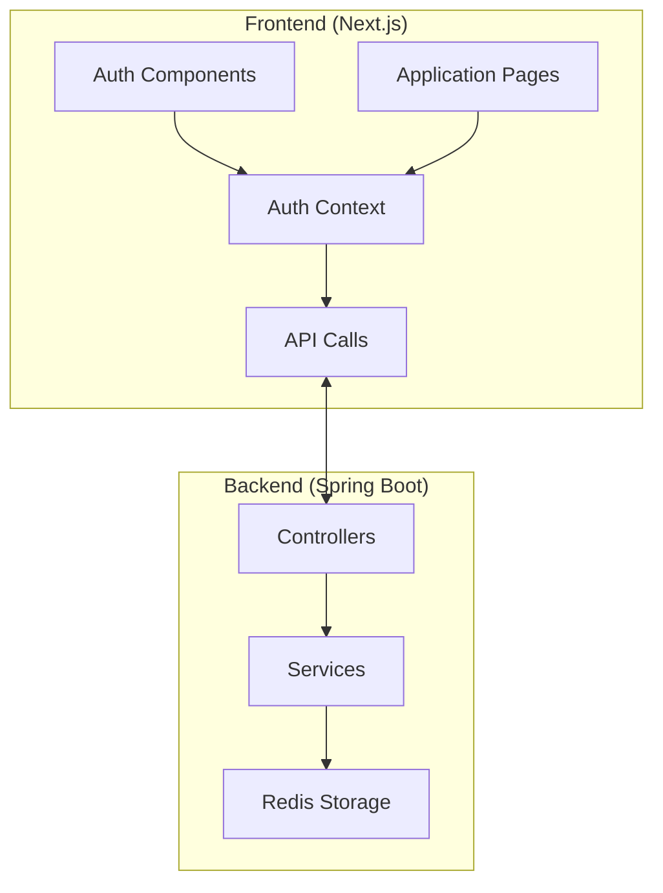
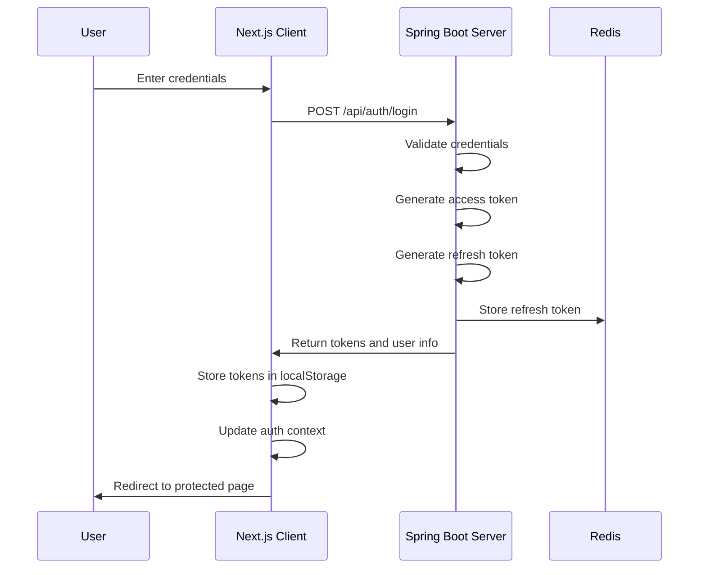
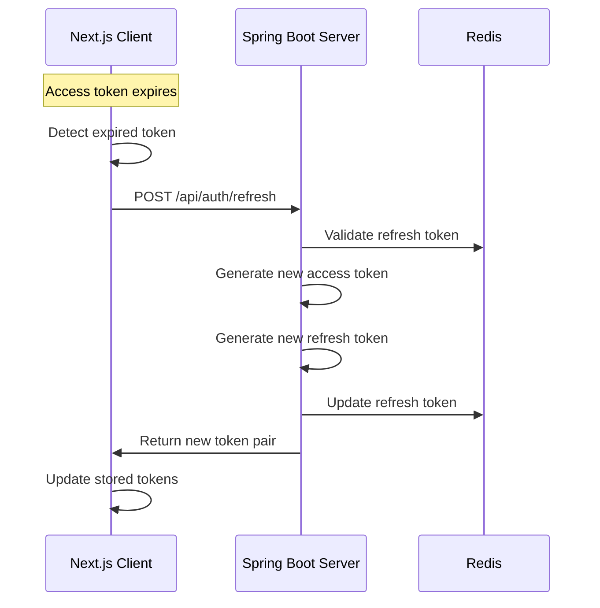
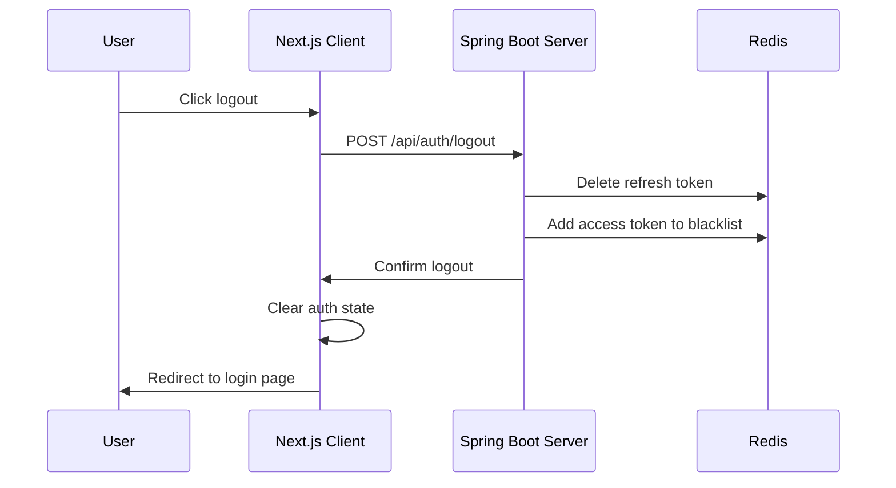
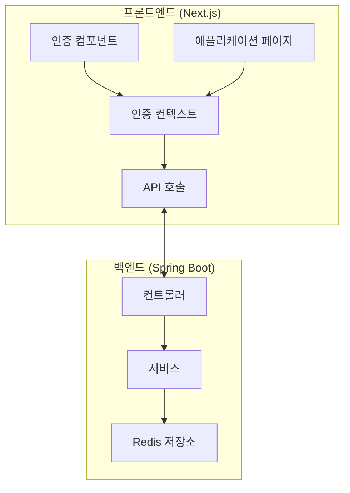
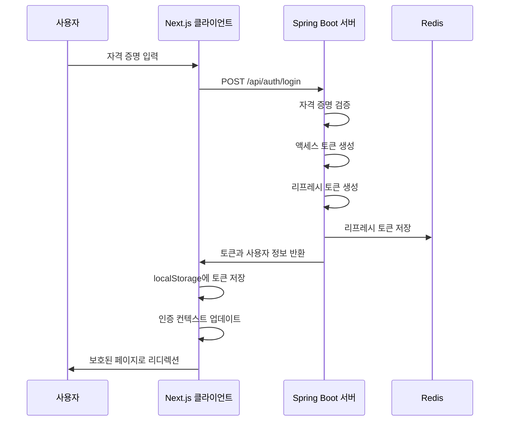
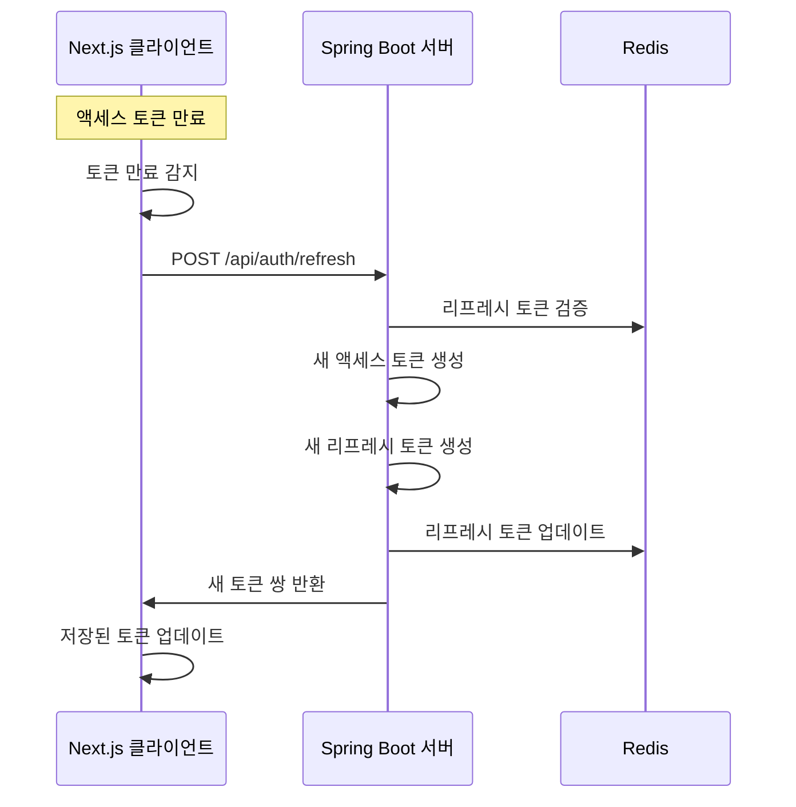

# JWT Authentication System

This project demonstrates a complete JWT (JSON Web Token) authentication system with a Next.js frontend client and a Spring Boot backend server. The system implements secure authentication flows with access tokens and refresh tokens stored in Redis.

## Project Structure

The project consists of two main components:

1. **auth-service-client**: Next.js frontend client application
2. **auth-service-test**: Spring Boot backend server application

### System Architecture



## Authentication Flow

### Login Flow



### Token Refresh Flow



### Logout Flow



## Detailed Component Descriptions

### Frontend (auth-service-client)

#### Key Components

1. **AuthContext** (`/app/components/auth/AuthContext.tsx`)
   - Provides authentication state to the entire application
   - Manages tokens and user information
   - Handles automatic token refresh
   - Implements authentication persistence

2. **Auth Library** (`/app/lib/auth.ts`)
   - Contains authentication-related utility functions
   - Implements JWT token handling (decoding, verifying)
   - Provides API calls for authentication endpoints

3. **Auth Components** (`/app/components/auth/AuthButtons.tsx`)
   - UI components for login/logout functionality
   - Login form with validation
   - Protected route functionality

#### Token Management

- Access tokens are stored in localStorage for persistence
- Token expiration is checked client-side
- Automatic refresh mechanism is triggered:
  - When access token is about to expire (< 10 seconds remaining)
  - On page refresh if access token is expired but refresh token is valid
  - When attempting to access a protected resource with expired token

### Backend (auth-service-test)

#### Key Components

1. **Controllers**
   - `AuthController`: Handles authentication endpoints (login, refresh, verify, logout)
   - `ApiTestController`: Demonstrates protected API endpoints
   - `TestController`: Basic test endpoint for server health check

2. **Services**
   - `AuthService`: Manages user authentication logic
   - `JwtService`: Handles JWT token operations (generation, validation, blacklisting)

3. **Configuration**
   - `RedisConfig`: Redis connection configuration
   - `CorsConfig`: CORS settings for cross-origin requests
   - `SecurityConfig`: Security rules for endpoint access

4. **Models**
   - `User`: User information model
   - `AuthTokens`: Token pair model
   - `JwtPayload`: JWT token payload structure
   - `JwtConstants`: JWT configuration constants

#### Token Implementation

- **Access Token**: Short-lived (15 seconds) token for API access
- **Refresh Token**: Longer-lived (10 minutes) token for obtaining new access tokens
- Redis is used to:
  - Store refresh tokens with user ID as key
  - Maintain a blacklist of revoked access tokens
  - Enable token revocation during logout

## API Endpoints

### Authentication Endpoints

| Endpoint | Method | Description | Request Body | Response |
|----------|--------|-------------|--------------|----------|
| `/api/auth/login` | POST | User login | `{email, password}` | `{user, tokens}` |
| `/api/auth/refresh` | POST | Refresh tokens | `{refreshToken}` | `{accessToken, refreshToken}` |
| `/api/auth/verify` | POST | Verify token | `{token}` | `{valid: boolean}` |
| `/api/auth/logout` | POST | Logout user | `{accessToken, userId}` | `{success: boolean}` |
| `/api/auth/me` | POST | Get user info | `{token}` | User object |

### Test Endpoints

| Endpoint | Method | Description | Auth Required |
|----------|--------|-------------|---------------|
| `/test` | GET | Server health check | No |
| `/api/public` | GET | Public API test | No |
| `/api/protected` | GET | Protected API test | Yes |
| `/api/admin` | GET | Admin-only API test | Yes (admin role) |

## Security Features

1. **Token-based Authentication**: Uses JWT for stateless authentication
2. **Token Refresh**: Implements sliding session with automatic token refresh
3. **Token Blacklisting**: Invalidates tokens on logout
4. **Redis Storage**: External storage for token management
5. **CORS Configuration**: Restricts cross-origin requests to allowed origins

## Implementation Details

### JWT Token Structure

**Access Token Payload:**
```json
{
  "sub": "userId",
  "email": "user@example.com",
  "name": "User Name",
  "role": "user",
  "iat": 1646121212,
  "exp": 1646121227
}
```

**Refresh Token Payload:**
```json
{
  "sub": "userId",
  "iat": 1646121212,
  "exp": 1646121812
}
```

### Redis Key Structure

- **Refresh Tokens**: `refresh:{userId}`
- **Blacklisted Tokens**: `blacklist:{tokenSignature}`

## Development Environment Setup

### Prerequisites

- Node.js (v14+)
- Java 17
- Redis server
- Docker (optional, for Redis)

### Running the Backend

```bash
cd auth-service-test
./mvnw spring-boot:run
```

### Running the Frontend

```bash
cd auth-service-client
npm install
npm run dev
```

### Running Redis with Docker

```bash
docker run --name redis -p 6379:6379 -d redis
```

## Testing

A test script is provided to verify token refresh functionality:

```bash
./test-token-refresh.sh
```

This script:
1. Logs in to get initial tokens
2. Tests protected API access
3. Waits for token expiration
4. Verifies expired token rejection
5. Tests token refresh
6. Verifies access with refreshed token

---

# JWT 인증 시스템

이 프로젝트는 Next.js 프론트엔드 클라이언트와 Spring Boot 백엔드 서버를 사용하는 완전한 JWT(JSON 웹 토큰) 인증 시스템을 보여줍니다. 이 시스템은 Redis에 저장된 액세스 토큰과 리프레시 토큰을 통해 안전한 인증 흐름을 구현합니다.

## 프로젝트 구조

이 프로젝트는 두 가지 주요 구성 요소로 이루어져 있습니다:

1. **auth-service-client**: Next.js 프론트엔드 클라이언트 애플리케이션
2. **auth-service-test**: Spring Boot 백엔드 서버 애플리케이션

### 시스템 아키텍처



## 인증 흐름

### 로그인 흐름



### 토큰 갱신 흐름



### 로그아웃 흐름


## 상세 컴포넌트 설명

### 프론트엔드 (auth-service-client)

#### 주요 컴포넌트

1. **AuthContext** (`/app/components/auth/AuthContext.tsx`)
   - 전체 애플리케이션에 인증 상태 제공
   - 토큰 및 사용자 정보 관리
   - 자동 토큰 갱신 처리
   - 인증 상태 유지 구현

2. **인증 라이브러리** (`/app/lib/auth.ts`)
   - 인증 관련 유틸리티 함수 포함
   - JWT 토큰 처리(디코딩, 검증) 구현
   - 인증 엔드포인트 API 호출 제공

3. **인증 컴포넌트** (`/app/components/auth/AuthButtons.tsx`)
   - 로그인/로그아웃 기능을 위한 UI 컴포넌트
   - 검증 기능이 있는 로그인 폼
   - 보호된 라우트 기능

#### 토큰 관리

- 액세스 토큰은 지속성을 위해 localStorage에 저장
- 토큰 만료는 클라이언트 측에서 확인
- 자동 갱신 메커니즘은 다음과 같은 경우에 트리거됨:
  - 액세스 토큰이 곧 만료될 때(< 10초 남음)
  - 페이지 새로고침 시 액세스 토큰이 만료되었지만 리프레시 토큰이 유효한 경우
  - 만료된 토큰으로 보호된 리소스에 접근 시도 시

### 백엔드 (auth-service-test)

#### 주요 컴포넌트

1. **컨트롤러**
   - `AuthController`: 인증 엔드포인트 처리(로그인, 갱신, 검증, 로그아웃)
   - `ApiTestController`: 보호된 API 엔드포인트 시연
   - `TestController`: 서버 상태 확인을 위한 기본 테스트 엔드포인트

2. **서비스**
   - `AuthService`: 사용자 인증 로직 관리
   - `JwtService`: JWT 토큰 작업 처리(생성, 검증, 블랙리스트)

3. **설정**
   - `RedisConfig`: Redis 연결 설정
   - `CorsConfig`: 교차 출처 요청에 대한 CORS 설정
   - `SecurityConfig`: 엔드포인트 접근을 위한 보안 규칙

4. **모델**
   - `User`: 사용자 정보 모델
   - `AuthTokens`: 토큰 쌍 모델
   - `JwtPayload`: JWT 토큰 페이로드 구조
   - `JwtConstants`: JWT 설정 상수

#### 토큰 구현

- **액세스 토큰**: API 접근을 위한 짧은 수명(15초) 토큰
- **리프레시 토큰**: 새 액세스 토큰을 얻기 위한 더 긴 수명(10분) 토큰
- Redis는 다음과 같은 용도로 사용됨:
  - 사용자 ID를 키로 사용하여 리프레시 토큰 저장
  - 취소된 액세스 토큰의 블랙리스트 유지
  - 로그아웃 시 토큰 취소 가능

## API 엔드포인트

### 인증 엔드포인트

| 엔드포인트 | 메소드 | 설명 | 요청 본문 | 응답 |
|----------|--------|-------------|--------------|----------|
| `/api/auth/login` | POST | 사용자 로그인 | `{email, password}` | `{user, tokens}` |
| `/api/auth/refresh` | POST | 토큰 갱신 | `{refreshToken}` | `{accessToken, refreshToken}` |
| `/api/auth/verify` | POST | 토큰 검증 | `{token}` | `{valid: boolean}` |
| `/api/auth/logout` | POST | 사용자 로그아웃 | `{accessToken, userId}` | `{success: boolean}` |
| `/api/auth/me` | POST | 사용자 정보 가져오기 | `{token}` | User 객체 |

### 테스트 엔드포인트

| 엔드포인트 | 메소드 | 설명 | 인증 필요 |
|----------|--------|-------------|---------------|
| `/test` | GET | 서버 상태 확인 | 아니오 |
| `/api/public` | GET | 공개 API 테스트 | 아니오 |
| `/api/protected` | GET | 보호된 API 테스트 | 예 |
| `/api/admin` | GET | 관리자 전용 API 테스트 | 예 (관리자 역할) |

## 보안 기능

1. **토큰 기반 인증**: 무상태 인증을 위한 JWT 사용
2. **토큰 갱신**: 자동 토큰 갱신으로 슬라이딩 세션 구현
3. **토큰 블랙리스트**: 로그아웃 시 토큰 무효화
4. **Redis 저장소**: 토큰 관리를 위한 외부 저장소
5. **CORS 설정**: 허용된 출처로 교차 출처 요청 제한

## 구현 세부 사항

### JWT 토큰 구조

**액세스 토큰 페이로드:**
```json
{
  "sub": "userId",
  "email": "user@example.com",
  "name": "User Name",
  "role": "user",
  "iat": 1646121212,
  "exp": 1646121227
}
```

**리프레시 토큰 페이로드:**
```json
{
  "sub": "userId",
  "iat": 1646121212,
  "exp": 1646121812
}
```

### Redis 키 구조

- **리프레시 토큰**: `refresh:{userId}`
- **블랙리스트 토큰**: `blacklist:{tokenSignature}`

## 개발 환경 설정

### 필수 조건

- Node.js (v14+)
- Java 17
- Redis 서버
- Docker (선택 사항, Redis용)

### 백엔드 실행

```bash
cd auth-service-test
./mvnw spring-boot:run
```

### 프론트엔드 실행

```bash
cd auth-service-client
npm install
npm run dev
```

### Docker로 Redis 실행

```bash
docker run --name redis -p 6379:6379 -d redis
```

## 테스트

토큰 갱신 기능을 검증하기 위한 테스트 스크립트가 제공됩니다:

```bash
./test-token-refresh.sh
```

이 스크립트는 다음과 같은 작업을 수행합니다:
1. 로그인하여 초기 토큰 얻기
2. 보호된 API 접근 테스트
3. 토큰 만료 대기
4. 만료된 토큰 거부 확인
5. 토큰 갱신 테스트
6. 갱신된 토큰으로 접근 확인 